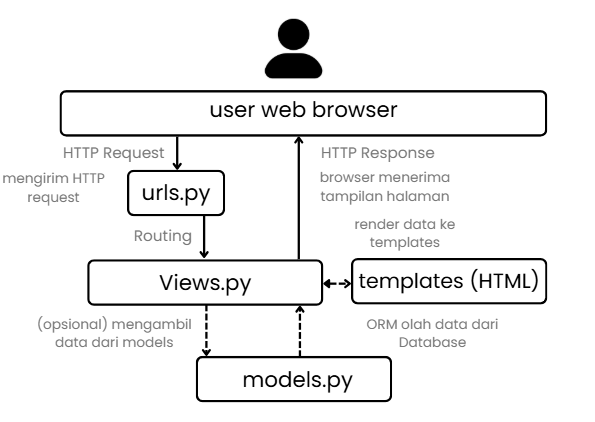

# Tugas 2: Implementasi Model-View-Template (MVT) pada Django
Nama: Muhammad Rifqi Ilham
NPM: 2406495483
Kelas: 2406495483
Link penugasan: https://pbp-fasilkom-ui.github.io/ganjil-2026/assignments/individual/assignment-2
Link Deployment: https://muhammad-rifqi411-footballnews.pbp.cs.ui.ac.id/

## 1. Jelaskan bagaimana cara kamu mengimplementasikan checklist di atas secara step-by-step (bukan hanya sekadar mengikuti tutorial).
Selain mengikuti tutorial, saya juga bereksperimen dalam membuat website agar terlihat lebih kreatif dengan menggunakan CSS. Walaupun, saya menemukan masalah bahwa PWS gagal menemukan CSS saya, padahal pada server local Django CSS berhasil ditemukan. Saya mencoba menggunakan collectstatic, tapi masih belum mengatasi masalah. Namun, Secara garis besar, saya berhasil mengerjakan yang diminta tutorial dengan langkah berikut:
1. Membuat environment python baru
2. Membuat proyek Django dan aplikasi main
3. Menambahkan konfigurasi pada settings.py untuk menambahkan nama app
4. membuat model product, dengan atribut yang diminta.
5. Melakukan migrasi database.
6. Konfigurasi pada views.py, dan mengatur routing di urls.py
7. Membuat tampilan website html dan css
8. Push ke PWS

## 2.  Buatlah bagan yang berisi request client ke web aplikasi berbasis Django beserta responnya dan jelaskan pada bagan tersebut kaitan antara urls.py, views.py, models.py, dan berkas html.

Penjelasan:
1. User mengirim HTTP request, Django lanjutkan ke urls.py
2. Jika request cocok, urls.py akan melanjutkan ke views.py (suatu fungsi atau class tertentu)
3. views.py meminta/mengubah data ke models.py (apabila dibutuhkan)
4. hasil data dikembalikan ke views.py
5. merender data ke templates html
6. template html jadi produk final, dikirim sebagai HTTP response

## 3. Jelaskan peran settings.py dalam proyek Django!
Settings.py dalam proyek Django berfungsi sebagai tempat penyimpanan semua pengaturan penting dalam proyek.
Hal-hal tersebut meliputi:
1. Pengaturan Database
2. Installed apps
3. Allowed Host
4. Templates
5. Keamanan & Autentikasi
Dan masih ada beberapa hal yang diatur di settings.py, pada dasarnya file ini adalah pusat penyimpanan konfigurasi penting proyek Django yang dibuat.

## 4. Bagaimana cara kerja migrasi database di Django?
1. Membuat / Mengubah models.py terlebih dahulu.
2. Melakukan migrations dengan menjalankan command:
`python manage.py makemigrations`
3. Setelah command dijalankan, Django akan membaca perubahan database dan membuat migrasi.
4. Lakukan migrasi dengan menjalankan command:
`python manage.py migrate`
5. Django akan mengeksekusi file menjadi query SQL, maka Migrasi database berhasil dilakukan.

## 5. Menurut Anda, dari semua framework yang ada, mengapa framework Django dijadikan permulaan pembelajaran pengembangan perangkat lunak?
1. Karena mahasiswa sudah mempelajari Python di DDP-1, sehingga akan lebih mudah dipahami.
2. Banyak fitur bawaan yang diberikan (ORM, Autentikasi, Middleware, Unit test, etc)
3. Lebih aman dan stabil, jika dibandingkan dengan bahasa lain (misal PHP)
4. kita bisa membaca dokumentasi lengkap dan Django yang popular memberikan komunitas yang kuat. 
5. Django dapat digunakan secara cepat untuk membangun prototype.

## 6. Apakah ada feedback untuk asisten dosen tutorial 1 yang telah kamu kerjakan sebelumnya?
Tutorial sangat seru !
